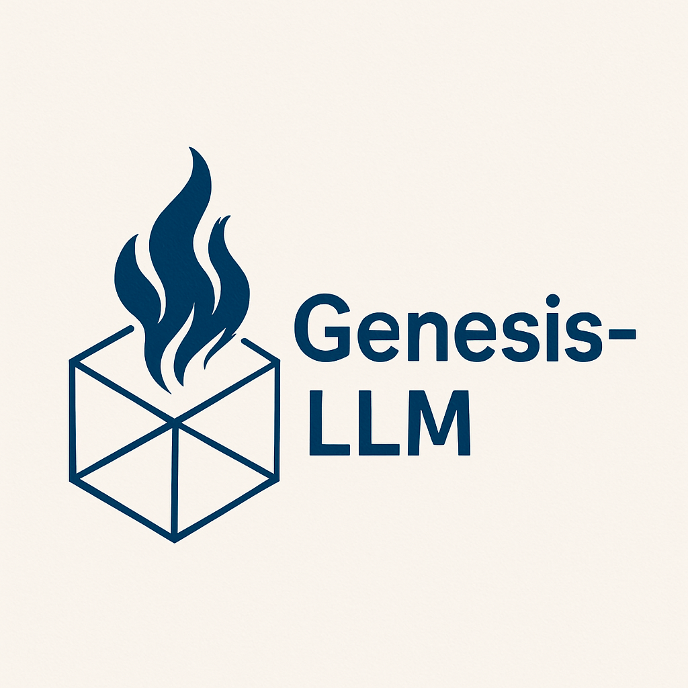

<div align="center">
  
  
  <h1>Genesis-LLM</h1>
  
  <p><strong>中文/领域大模型训练全流程工具包</strong></p>
  
  <p>
    <a href="#快速开始">快速开始</a> •
    <a href="#功能模块">功能模块</a> •
    <a href="#项目结构">项目结构</a> •
    <a href="https://github.com/likebeans/Genesis-LLM">GitHub</a>
  </p>
  
  
  
  
  
</div>

---

## 目录

- [项目简介](#项目简介)
- [功能模块](#功能模块)
  - [1. 数据处理 (data_process/)](#1-数据处理-data_process)
  - [2. 词表扩充 (tokenizer/)](#2-词表扩充-tokenizer)
  - [3. 模型训练 (self_model/)](#3-模型训练-self_model)
  - [4. 模型推理与部署 (inference/)](#4-模型推理与部署-inference)
  - [5. 配置管理 (config/)](#5-配置管理-config)
- [快速开始](#快速开始)
- [环境要求](#环境要求)
- [项目结构](#项目结构)
- [开发规范](#开发规范)
- [常见问题](#常见问题)
- [License](#license)

---

## 项目简介

**Genesis-LLM** 是一个完整的大语言模型训练工具包，专为中文和领域特定模型开发设计。项目覆盖从数据采集、词表扩充、模型训练到推理部署的全流程。

### 核心特性

- **数据处理管线** - HuggingFace 数据集采集、清洗、去重、质量筛选
- **词表扩充** - 中文/领域词表训练与合并，Embedding 扩展
- **高效微调** - 支持 LoRA/QLoRA 参数高效微调，显存占用低
- **RLHF 对齐** - 支持 DPO、PPO、GRPO 等对齐算法
- **配置驱动** - 所有参数通过 YAML 配置管理，易于复现
- **实验追踪** - 集成 WandB / SwanLab 实时监控
- **推理部署** - vLLM 高性能推理、llama.cpp 边缘部署、AWQ/GPTQ 量化

### 技术栈

`Python 3.10+` · `PyTorch 2.1+` · `Transformers` · `PEFT` · `SentencePiece` · `Datasets` · `Accelerate` · `vLLM`

---

## 功能模块

### 1. 数据处理 (data_process/)

<!-- TODO: 
- 数据采集：HuggingFace 数据集下载
- 数据清洗：去重、过滤、质量筛选
- 输出格式：JSONL / Parquet
-->

### 2. 词表扩充 (tokenizer/)

<!-- TODO:
- 辅助词表训练（SentencePiece）
- Token 筛选与合并
- Embedding 扩展
- 效果评估
-->

### 3. 模型训练 (self_model/)

<!-- TODO:
- 继续预训练（CPT）
- 监督微调（SFT）+ LoRA/QLoRA
- RLHF 对齐（DPO/PPO/GRPO）
- 实验追踪（WandB/SwanLab）
-->

### 4. 模型推理与部署 (inference/)

<!-- TODO:
- vLLM 高性能推理服务
- llama.cpp GGUF 转换
- AWQ/GPTQ 量化
-->

### 5. 配置管理 (config/)

<!-- TODO:
- YAML 配置驱动
- 训练/追踪/词表配置分离
-->

---

## 快速开始

<!-- TODO: 添加安装和基本使用步骤 -->

```bash
# 安装依赖
uv sync

# 或使用 pip
pip install -e .
```

---

## 环境要求

<!-- TODO: Python 版本、CUDA、依赖等 -->

---

## 项目结构

<!-- TODO: 目录树 -->

---

## 开发规范

<!-- TODO: 代码风格、提交规范等 -->

---

## 常见问题

<!-- TODO: FAQ -->

---

## License

<!-- TODO: 许可证信息 -->
